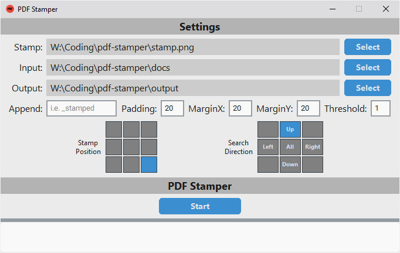
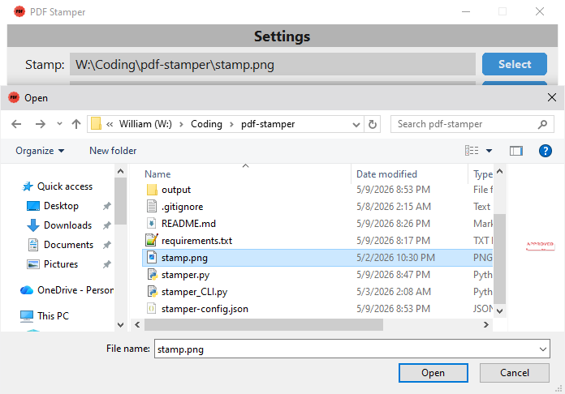
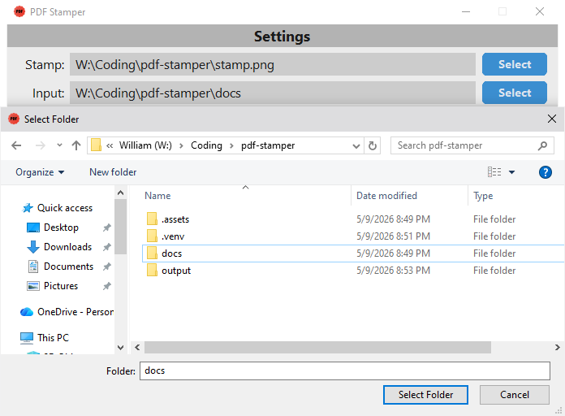
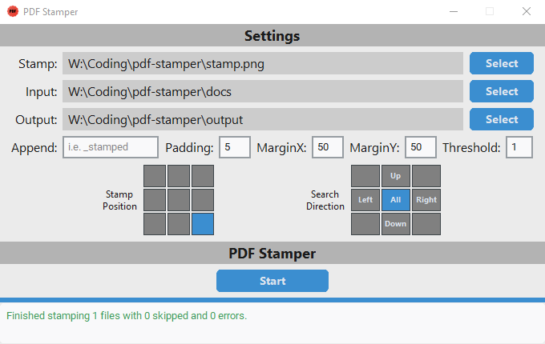
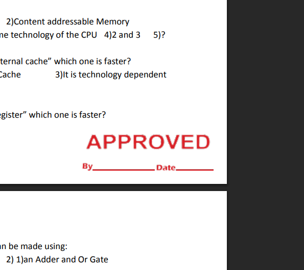

# PDF Stamper

Mass stamps files in a specified folder with a specified stamp img.

<p align="center">
  
</p>

# Requirements

- Only needed for development; not needed for regular users.
- Python >= 3.9
- For program development.
  - `make install` OR `pip install -e .`

- For compiling into `.exe` and testing.
  - `make install-dev` OR `pip install -e .[dev]`

# How To use (GUI - [stamper.py](src/pdf_stamper/stamper.py))

1. Download from the [releases](https://github.com/ThomasQTruong/pdf-stamper/releases).
2. Open the program.
   - 
3. Select the stamp image (default: `./stamp.png`).
   - 
4. Select the input directory (folder that contains all the PDFs to stamp; default: `./docs/`).
   - 
5. Enter the other settings or leave default.
   - `Output`: The folder to output the stamped files to (default: `./output/`).
   - `Append`: Add certain text to the end of the file name.
     - i.e. Append = `_stamped` would result in `file.pdf` => `file_stamped.pdf`
   - `Padding`: The x/y axis spacing between the stamp and the page's texts (default: `20`).
   - `MarginX`: The x-axis spacing of the stamp away from the page left/right edges (default: `20`).
   - `MarginY`: The y-axis spacing of the stamp away from the page top/bottom edges (default: `20`).
   - `Threshold`: The search threshold for finding an empty space to stamp (default: `1`).
     - Only stamps on the right side, starts from bottom then searches upward for space.
     - Set to `0` to disable searching.
   - `Stamp Position`: The position on a 3x3 grid of where to stamp (default: bottom-right).
   - `Search Direction`: The direction to search for an empty spot to stamp (default: up).
     - Set to `Threshold` to `0` to disable.
6. Click start and the files should be stamped!
   - 
   - 

# How to use (CLI - [cli.py](src/pdf_stamper/cli.py))

1. Download from the [releases](https://github.com/ThomasQTruong/pdf-stamper/releases).
2. Open the program via terminal:

- Windows: `pdf-stamper-cli-win.exe --help`

- Unix: `./pdf-stamper-cli-unix --help`

3. Enter the command with the flags as shown under help.

- i.e.: `./pdf-stamper-cli-unix --stamp stamp.png --padding 5 --margin-x 50 ...`

# Generate Files

#### GUI

- Windows
  - Using Makefile: `make gui`
  - OR directly:
    - ```bash
      pyinstaller --noconfirm --onefile --windowed --icon=".assets/app/icon.ico" --add-data ".assets/app/icon.png$(SEP)." --add-data ".assets/app/icon.ico$(SEP)." --paths src --name "pdf-stamper-win" src/pdf_stamper/stamper.py
      ```

- Unix
  - Using Makefile: `make gui`
  - OR directly:
    - ```bash
      pyinstaller --noconfirm --onefile --add-data ".assets/app/icon.png$(SEP)." --hidden-import PIL._tkinter_finder --paths src --name "pdf-stamper-unix" src/pdf_stamper/stamper.py
      ```

#### CLI

- Windows
  - Using Makefile: `make cli`
  - OR directly:
    - ```bash
      pyinstaller --noconfirm --onefile --paths src --name "pdf-stamper-cli-win" src/pdf_stamper/cli.py
      ```

- Unix
  - Using Makefile: `make cli`
  - OR directly:
    - ```bash
      pyinstaller --noconfirm --onefile --paths src --name "pdf-stamper-cli-unix" src/pdf_stamper/cli.py
      ```
